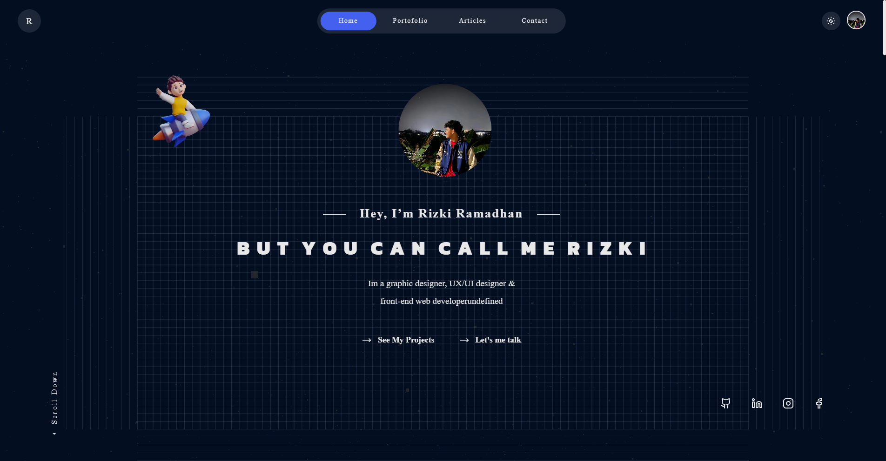

# Rizki Ramadhan Portfolio 🚀

Welcome to my professional portfolio website! This site showcases my work as a Fullstack Developer and my journey in web development.

## 🌐 Live Demo

Check out my portfolio at [my-portofolio-rizki-r.vercel.app](https://my-portofolio-rizki-r.vercel.app/)

## ⚡ Tech Stack

This portfolio is built with:

- Next.js 15
- React 18
- Three.js
- Framer Motion
- Firebase
- GSAP
- SWR
- React Query
- SASS
- React Hot Toast
- React Icons
- Lucide React
- React Paginate
- React Quill
- React Share
- Swiper
- Date-fns

## 🎯 Features

- 🎨 Modern and Clean Design
- 📱 Fully Responsive
- ⚡ Fast Performance
- 🌙 Dark/Light Mode
- 🎬 Smooth Animations
- 📊 Interactive Components
- 🎮 3D Elements
- 📝 Project Section
- 📈 Skills
- 📱 Social Media Integration
- 📬 Contact Form with Validation
- 🎨 Custom CSS Animations
- 🔄 Loading States/Transitions
- 📱 PWA Support
- 🔒 Firebase Authentication

## 🛠️ Projects Showcase

Browse through my featured projects and see my skills in action. Each project includes:

- Detailed descriptions
- Technologies used
- Live demos
- Source code links

## 📫 Get in Touch

- Email: rr8027896@gmail.com
- LinkedIn: [Rizki Ramadhan](https://www.linkedin.com/in/rizki-ramadhan12)
- Instagram: [rzkir.20](https://www.instagram.com/rzkir.20)
- GitHub: [Rineta2](https://github.com/Rineta2)

## 🚀 Local Development

To run this project locally:

1. Clone the repository
2. Install dependencies
3. Run the development server
